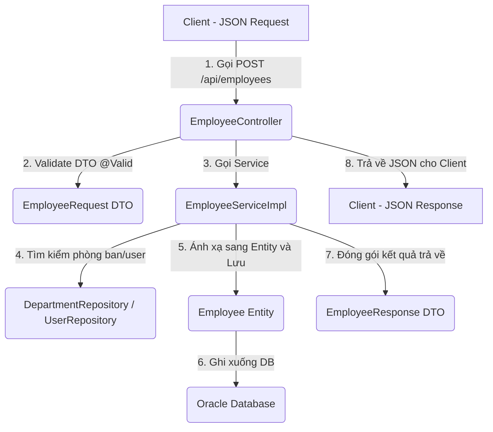

# TÀI LIỆU HƯỚNG DẪN HỌC & HIỂU DỰ ÁN QUẢN LÝ NHÂN SỰ (HRM)
**Công nghệ:** Spring Boot 3.x, JPA/Hibernate, Oracle Database, Lombok

Tài liệu này được biên soạn nhằm giúp bạn nắm bắt toàn bộ dự án từ cấu trúc thư mục, luồng chạy dữ liệu đến cách giải thích chi tiết từng dòng code trong các cấu phần chính. Bạn có thể mở file này trực tiếp bằng các công cụ đọc Markdown (như VS Code, IntelliJ) hoặc chuyển đổi sang file Word (.docx) để in/học dễ dàng.

---

## MỤC LỤC
1. Tổng Quan Kiến Trúc Dự Án
2. Luồng Chạy Của Dữ Liệu (Data Flow)
3. Cơ Chế Quan Hệ Trong JPA (JPA Relationships)
4. Giải Thích Chi Tiết Các File Code Chính
5. Hướng Dẫn Chạy & Kiểm Thử API

---

## 1. TỔNG QUAN KIẾN TRÚC DỰ ÁN
Dự án được xây dựng theo kiến trúc phân lớp chuẩn của Spring Boot:
* **Entity**: Đại diện cho các bảng trong Database. Mỗi thuộc tính trong Entity sẽ ánh xạ (map) trực tiếp với một cột trong bảng.
* **DTO (Data Transfer Object)**: Đối tượng vận chuyển dữ liệu. Tách biệt dữ liệu truyền vào (`Request`) và dữ liệu trả ra cho client (`Response`) để bảo mật và tối ưu dung lượng truyền tải.
* **Repository**: Tầng truy cập cơ sở dữ liệu. Kế thừa `JpaRepository` để sử dụng các hàm CRUD có sẵn.
* **Service**: Nơi xử lý logic nghiệp vụ (Business Logic), kiểm tra ràng buộc trước khi lưu vào DB.
* **Controller**: Nơi đón nhận các request HTTP từ client (Frontend/Postman), định tuyến tới Service tương ứng và trả về kết quả.
* **Exception & Global Exception Handler**: Nơi xử lý và gom tất cả các lỗi xảy ra trong hệ thống để trả về mã lỗi HTTP chuẩn.

---

## 2. LUỒNG CHẠY CỦA DỮ LIỆU (DATA FLOW)
Khi Frontend thực hiện thao tác (Ví dụ: Tạo mới một Nhân viên):



1. **Client** gửi một chuỗi JSON chứa thông tin nhân viên qua giao thức HTTP (Method POST).
2. **Controller** tiếp nhận dữ liệu, tự động chuyển đổi JSON thành `EmployeeRequest` DTO. Annotation `@Valid` kiểm tra xem dữ liệu đầu vào có hợp lệ không (ví dụ: email có đúng định dạng không).
3. **Controller** gọi phương thức tại lớp **Service**.
4. **Service** thực hiện các nghiệp vụ:
   - Kiểm tra email đã bị trùng chưa bằng `EmployeeRepository`.
   - Tìm thực thể `Department` (Phòng ban) tương ứng bằng `DepartmentRepository`.
5. **Service** đổ dữ liệu từ DTO sang thực thể **Employee Entity**, liên kết đối tượng `Department` vào thực thể đó.
6. **Service** gọi `employeeRepository.save()`, JPA tự sinh câu lệnh SQL `INSERT` lưu dữ liệu xuống **Oracle Database**.
7. **Service** chuyển đổi thực thể `Employee` vừa lưu thành `EmployeeResponse` DTO (để đưa thêm các thông tin như tên phòng ban).
8. **Controller** nhận được DTO kết quả từ Service và trả về dưới dạng JSON kèm HTTP Status `200 OK` cho Frontend.

---

## 3. CƠ CHẾ QUAN HỆ TRONG JPA (JPA RELATIONSHIPS)
Trong dự án này, chúng ta đã tối ưu quan hệ giữa các bảng:
* **`@ManyToOne(fetch = FetchType.LAZY)`**: Một Phòng ban có nhiều nhân viên, ngược lại một Nhân viên chỉ thuộc một Phòng ban. 
* **`@OneToOne(fetch = FetchType.LAZY)`**: Mỗi tài khoản đăng nhập (User) chỉ thuộc về duy nhất một nhân viên.
* **`FetchType.LAZY` (Tải chậm)**: Là cơ chế cực kỳ quan trọng giúp tối ưu hóa hiệu năng hệ thống. Khi bạn lấy thông tin nhân viên từ Database, Hibernate sẽ **không** tự động tải luôn thông tin phòng ban hay user liên kết nhằm tiết kiệm thời gian xử lý. Chỉ khi nào trong code Java bạn thực sự gọi đến phương thức `employee.getDepartment()`, Hibernate mới lập tức phát ra câu lệnh SQL phụ để tải dữ liệu phòng ban lên.

---

## 4. GIẢI THÍCH CHI TIẾT CÁC FILE CODE CHÍNH

### A. Tầng Entity (Thực thể ánh xạ Database)
Dưới đây là cấu trúc của **Employee Entity** với chú thích chi tiết từng dòng:

```java
package com.huy.hrm_backend.Entity;

import jakarta.persistence.*;
import lombok.Data;
import java.time.LocalDate;

@Data // Tự động tạo getter, setter, toString nhờ thư viện Lombok
@Entity // Đánh dấu lớp này là một thực thể JPA tương ứng với một bảng trong DB
@Table(name = "EMPLOYEES") // Map với tên bảng EMPLOYEES trong Database
public class Employee {

    @Id // Khai báo trường này là khóa chính
    @GeneratedValue(strategy = GenerationType.SEQUENCE, generator = "employee_seq") // Sử dụng Sequence để tự sinh ID
    @SequenceGenerator(
            name = "employee_seq",
            sequenceName = "EMPLOYEES_SEQ", // Tên sequence trong Oracle Database
            allocationSize = 1 // Mỗi lần lưu mới ID sẽ tăng lên 1 đơn vị
    )
    @Column(name = "ID")
    private long id;

    @Column(name = "FULL_NAME")
    private String fullName;

    @Column(name = "EMAIL")
    private String email;

    @Column(name = "PHONE")
    private String phone;

    @Column(name = "GENDER")
    private String gender;

    @Column(name = "DATE_OF_BIRTH")
    private LocalDate dateOfBirth;

    @Column(name = "ADDRESS")
    private String address;

    @Column(name = "POSITION_NAME")
    private String positionName;

    @Column(name = "SALARY_BASE")
    private double salaryBase;

    // Thiết lập quan hệ Nhiều nhân viên thuộc Một phòng ban
    @ManyToOne(fetch = FetchType.LAZY)
    @JoinColumn(name = "DEPARTMENT_ID") // Tên cột khóa ngoại liên kết trong database
    private Department department;

    // Thiết lập quan hệ Một nhân viên sở hữu Một tài khoản đăng nhập
    @OneToOne(fetch = FetchType.LAZY)
    @JoinColumn(name = "USER_ID") // Tên cột khóa ngoại liên kết trong database
    private User user;
}
```

---

### B. Tầng DTO (Vận chuyển dữ liệu)
DTO giúp Frontend nhận đủ dữ liệu cần thiết mà không phải nhận thừa thông tin hoặc các trường bảo mật (như password).

File **EmployeeResponse.java** (Dữ liệu trả về cho Frontend):
```java
package com.huy.hrm_backend.Dto;

import lombok.Data;
import java.time.LocalDate;

@Data
public class EmployeeResponse {
    private Long id;
    private String fullName;
    private String email;
    private String phone;
    private String gender;
    private LocalDate dateOfBirth;
    private String address;
    private String positionName;
    private Double salaryBase;
    
    // Tên phòng ban và tên tài khoản được lấy từ thực thể liên kết ra để Frontend hiển thị trực tiếp
    private Long departmentId;
    private String departmentName; 
    private Long userId;
    private String userName;
}
```

---

### C. Tầng Repository (Truy xuất Database)
Kế thừa `JpaRepository` giúp ta có sẵn các hàm cơ bản như `save()`, `findById()`, `findAll()`, `deleteById()`.

File **UserRepository.java**:
```java
package com.huy.hrm_backend.Repository;

import com.huy.hrm_backend.Entity.User;
import org.springframework.data.jpa.repository.JpaRepository;

public interface UserRepository extends JpaRepository<User, Long> {
    // Tự sinh câu SQL kiểm tra xem username đã tồn tại chưa khi tạo mới
    boolean existsByUserName(String userName);
    
    // Kiểm tra trùng username khi cập nhật (loại trừ chính ID của user hiện tại)
    boolean existsByUserNameAndIdNot(String userName, Long id);
}
```

---

### D. Tầng Service (Xử lý nghiệp vụ)
Nơi chứa toàn bộ tư duy logic xử lý của hệ thống.

File **EmployeeServiceImpl.java**:
```java
package com.huy.hrm_backend.Service.Service.impl;

import com.huy.hrm_backend.Dto.EmployeeRequest;
import com.huy.hrm_backend.Dto.EmployeeResponse;
import com.huy.hrm_backend.Entity.Department;
import com.huy.hrm_backend.Entity.Employee;
import com.huy.hrm_backend.Entity.User;
import com.huy.hrm_backend.Exception.EmailAlreadyExistsException;
import com.huy.hrm_backend.Exception.ResourceNotFoundException;
import com.huy.hrm_backend.Repository.DepartmentRepository;
import com.huy.hrm_backend.Repository.EmployeeRepository;
import com.huy.hrm_backend.Repository.UserRepository;
import com.huy.hrm_backend.Service.EmployeeService;
import lombok.RequiredArgsConstructor;
import org.springframework.stereotype.Service;
import java.util.List;

@Service // Báo cho Spring biết đây là lớp tầng Service
@RequiredArgsConstructor // Tự sinh constructor để tự động tiêm (Inject) các Repository bên dưới
public class EmployeeServiceImpl implements EmployeeService {

    private final EmployeeRepository employeeRepository;
    private final DepartmentRepository departmentRepository;
    private final UserRepository userRepository;

    @Override
    public EmployeeResponse createEmployee(EmployeeRequest request) {
        // 1. Kiểm tra trùng email nhân viên trong database
        if (employeeRepository.existsByEmail(request.getEmail())) {
            throw new EmailAlreadyExistsException("Email already exists: " + request.getEmail());
        }

        // 2. Chuyển thông tin từ Request sang Entity
        Employee employee = new Employee();
        employee.setFullName(request.getFullName());
        employee.setEmail(request.getEmail());
        employee.setPhone(request.getPhone());
        employee.setGender(request.getGender());
        employee.setDateOfBirth(request.getDateOfBirth());
        employee.setAddress(request.getAddress());
        employee.setPositionName(request.getPositionName());
        employee.setSalaryBase(request.getSalaryBase());

        // 3. Tìm phòng ban theo ID. Nếu không thấy sẽ dừng chương trình và báo lỗi
        Department department = departmentRepository.findById(request.getDepartmentId())
                .orElseThrow(() -> new ResourceNotFoundException("Department not found with id: " + request.getDepartmentId()));
        employee.setDepartment(department); // Liên kết đối tượng phòng ban

        // 4. Tìm tài khoản User theo ID (nếu có truyền vào)
        if (request.getUserId() != null) {
            User user = userRepository.findById(request.getUserId())
                    .orElseThrow(() -> new ResourceNotFoundException("User not found with id: " + request.getUserId()));
            employee.setUser(user); // Liên kết đối tượng tài khoản
        }

        // 5. Lưu xuống Database và chuyển đổi dữ liệu sang DTO Response để trả về
        Employee savedEmployee = employeeRepository.save(employee);
        return mapToResponse(savedEmployee);
    }

    // Hàm phụ trợ map từ Entity sang DTO Response để trả về Client
    private EmployeeResponse mapToResponse(Employee employee) {
        EmployeeResponse response = new EmployeeResponse();
        response.setId(employee.getId());
        response.setFullName(employee.getFullName());
        response.setEmail(employee.getEmail());
        response.setPhone(employee.getPhone());
        response.setGender(employee.getGender());
        response.setDateOfBirth(employee.getDateOfBirth());
        response.setAddress(employee.getAddress());
        response.setPositionName(employee.getPositionName());
        response.setSalaryBase(employee.getSalaryBase());

        // Nếu nhân viên có liên kết phòng ban, lấy thông tin gán cho DTO
        if (employee.getDepartment() != null) {
            response.setDepartmentId(employee.getDepartment().getId());
            response.setDepartmentName(employee.getDepartment().getName());
        }

        // Nếu nhân viên có liên kết tài khoản, lấy thông tin gán cho DTO
        if (employee.getUser() != null) {
            response.setUserId(employee.getUser().getId());
            response.setUserName(employee.getUser().getUserName());
        }

        return response;
    }
    
    // ... Các hàm khác tương tự
}
```

---

### E. Tầng Controller (Đón nhận Request & Trả về Response)
Controller đóng vai trò như người bảo vệ, chỉ nhận dữ liệu, gọi tầng Service và trả kết quả về.

File **EmployeeController.java**:
```java
package com.huy.hrm_backend.Controller;

import com.huy.hrm_backend.Dto.EmployeeRequest;
import com.huy.hrm_backend.Dto.EmployeeResponse;
import com.huy.hrm_backend.Service.EmployeeService;
import jakarta.validation.Valid;
import lombok.RequiredArgsConstructor;
import org.springframework.web.bind.annotation.*;
import java.util.List;

@RestController // Đánh dấu lớp REST Controller
@RequestMapping("/api/employees") // Đường dẫn gốc cho thực thể Employee
@RequiredArgsConstructor
@CrossOrigin("*") // Cho phép liên kết CORS từ mọi cổng Frontend (Ví dụ: React chạy ở port 3000)
public class EmployeeController {

    private final EmployeeService employeeService;

    @GetMapping
    public List<EmployeeResponse> getAllEmployees() {
        return employeeService.getAllEmployees();
    }

    @GetMapping("/{id}")
    public EmployeeResponse getEmployeeById(@PathVariable Long id) {
        return employeeService.getEmployeeById(id);
    }

    @PostMapping
    public EmployeeResponse createEmployee(@Valid @RequestBody EmployeeRequest request) {
        // @Valid: Kích hoạt kiểm tra validation của DTO trước khi chạy code
        // @RequestBody: Tự chuyển đổi JSON body nhận được sang đối tượng Java
        return employeeService.createEmployee(request);
    }

    @PutMapping("/{id}")
    public EmployeeResponse updateEmployee(@PathVariable Long id, @Valid @RequestBody EmployeeRequest request) {
        return employeeService.updateEmployee(id, request);
    }

    @DeleteMapping("/{id}")
    public String deleteEmployee(@PathVariable Long id) {
        employeeService.deleteEmployee(id);
        return "Delete employee successfully";
    }
}
```

---

### F. Bộ Xử Lý Lỗi Tập Trung (Global Exception Handler)
Nhờ có lớp này, bất kỳ khi nào có exception xảy ra trong ứng dụng, chúng đều bị chặn lại và trả ra một JSON báo lỗi thân thiện thay vì crash server.

File **GlobalExceptionHandler.java**:
```java
package com.huy.hrm_backend.Exception;

import org.springframework.http.HttpStatus;
import org.springframework.http.ResponseEntity;
import org.springframework.web.bind.MethodArgumentNotValidException;
import org.springframework.web.bind.annotation.ExceptionHandler;
import org.springframework.web.bind.annotation.RestControllerAdvice;
import java.util.HashMap;
import java.util.Map;

@RestControllerAdvice // Đánh dấu bộ lắng nghe ngoại lệ toàn cục
public class GlobalExceptionHandler {

    // Bắt lỗi Validation (Khi các trường như Email, Phone không đúng định dạng)
    @ExceptionHandler(MethodArgumentNotValidException.class)
    public ResponseEntity<Map<String, String>> handlerValidationException(MethodArgumentNotValidException ex) {
        Map<String, String> errors = new HashMap<>();
        ex.getBindingResult().getFieldErrors().forEach(error -> {
            errors.put(error.getField(), error.getDefaultMessage());
        });
        return new ResponseEntity<>(errors, HttpStatus.BAD_REQUEST); // Mã lỗi 400
    }

    // Bắt lỗi khi không tìm thấy tài nguyên
    @ExceptionHandler(ResourceNotFoundException.class)
    public ResponseEntity<Map<String, String>> handlerResourceNotFoundException(ResourceNotFoundException ex){
        Map<String, String> error = new HashMap<>();
        error.put("message", ex.getMessage());
        return new ResponseEntity<>(error, HttpStatus.NOT_FOUND); // Mã lỗi 404
    }

    // Bắt lỗi khi đăng ký trùng email
    @ExceptionHandler(EmailAlreadyExistsException.class)
    public ResponseEntity<Map<String, String>> handleEmailAlreadyExistsException(EmailAlreadyExistsException ex){
        Map<String, String> error = new HashMap<>();
        error.put("message", ex.getMessage());
        return new ResponseEntity<>(error, HttpStatus.CONFLICT); // Mã lỗi 409
    }
}
```

---

## 5. HƯỚNG DẪN CHẠY & KIỂM THỬ API
Để kiểm tra xem dự án chạy có đúng mong đợi hay không:

1. **Khởi động Database**: Hãy chắc chắn cơ sở dữ liệu Oracle Database của bạn đã khởi động và có sẵn schema `hrm` khớp với cấu hình trong file `application.properties`.
2. **Chạy ứng dụng**: Bạn có thể chạy ứng dụng Spring Boot bằng cách nhấn nút Run trong IntelliJ/Eclipse hoặc chạy lệnh Maven trên terminal:
   ```bash
   mvn spring-boot:run
   ```
3. **Kiểm tra API bằng Postman**:
   * **Lấy danh sách nhân viên**: Gửi Request `GET` tới URL `http://localhost:8080/api/employees`
   * **Tạo mới nhân viên**: Gửi Request `POST` tới URL `http://localhost:8080/api/employees` với JSON Body dạng:
     ```json
     {
       "fullName": "Nguyễn Văn A",
       "email": "nguyenvana@gmail.com",
       "phone": "0912345678",
       "gender": "MALE",
       "dateOfBirth": "2000-01-01",
       "address": "Hà Nội",
       "positionName": "Developer",
       "salaryBase": 15000000.0,
       "departmentId": 1
     }
     ```
   * Bạn có thể thử gửi thông tin sai định dạng email hoặc thiếu các trường bắt buộc để xem lỗi `400 Bad Request` trả về như thế nào nhé!

---
*Chúc bạn học tập tốt và gặt hái được nhiều kiến thức bổ ích để chuẩn bị cho kỳ thực tập sắp tới!*
